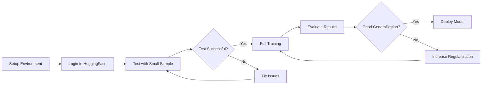

# 🚀 Calma AI - Model Retraining (Anti-Overfitting)

## Problem Solved

Your Calma model was **overfitting** - memorizing training data instead of learning general patterns. This new training pipeline fixes that using a large, diverse Hugging Face dataset with proper anti-overfitting measures.

## Quick Start (3 Commands)

```bash
# 1. Setup environment
./setup_training.sh

# 2. Login to Hugging Face (one-time)
source calma/bin/activate
huggingface-cli login

# 3. Train the model
python3 train_with_hf_dataset.py
```

**Time**: ~2-4 hours (GPU) or ~8-12 hours (CPU)

---

## 📚 Documentation

Choose your guide based on your needs:

### 🎯 [QUICKSTART.md](QUICKSTART.md) - Start Here!
- Quick 3-step setup
- Test runs before full training
- Common options and examples
- Time estimates
- Pro tips

### 📖 [RETRAINING_GUIDE.md](RETRAINING_GUIDE.md) - Detailed Guide
- Complete explanation of anti-overfitting measures
- All configuration options
- Troubleshooting section
- Understanding metrics
- Integration instructions

### 📊 [TRAINING_SUMMARY.md](TRAINING_SUMMARY.md) - Technical Overview
- What was done and why
- Before/after comparison
- Technical details
- Configuration reference
- Checklist

---

## 🔧 Anti-Overfitting Measures

### ✅ Dataset Improvements
- Large, diverse HF dataset (10,000+ vs 300 examples)
- Proper 80/10/10 train/val/test splits
- Quality filtering removes noise
- No aggressive augmentation

### ✅ Model Improvements
- Early stopping (stops at optimal point)
- Increased regularization (weight decay, dropout)
- Lower learning rate (more stable)
- Rank-stabilized LoRA
- Dynamic padding

### ✅ Monitoring
- Validation vs test loss tracking
- Automatic overfitting detection
- Best model checkpointing

---

## 📁 New Files

### Training Pipeline
- **[train_with_hf_dataset.py](train_with_hf_dataset.py)** - Main entry point
- **[src/data_processing_hf.py](src/data_processing_hf.py)** - Dataset processor
- **[src/model_training_improved.py](src/model_training_improved.py)** - Training script

### Setup & Testing
- **[setup_training.sh](setup_training.sh)** - One-command setup
- **[test_setup.py](test_setup.py)** - Verify installation
- **[requirements-training.txt](requirements-training.txt)** - Dependencies

### Documentation
- **[QUICKSTART.md](QUICKSTART.md)** - Quick start guide ⭐
- **[RETRAINING_GUIDE.md](RETRAINING_GUIDE.md)** - Detailed guide
- **[TRAINING_SUMMARY.md](TRAINING_SUMMARY.md)** - Technical summary

---

## 🎯 What to Expect

### Good Results ✅
```
Validation Loss: 1.23
Test Loss: 1.25
Loss Difference: 0.02  ← Excellent! (< 0.1)
```

### Still Overfitting ⚠️
```
Validation Loss: 1.23
Test Loss: 1.58
Loss Difference: 0.35  ← Too high (> 0.2)
```

If still overfitting, use more regularization:
```bash
python3 train_with_hf_dataset.py --weight-decay 0.02 --lora-dropout 0.2 --epochs 2
```

---

## 🔄 Workflow



---

## 💡 Usage Examples

### Test Run (5 minutes)
```bash
python3 train_with_hf_dataset.py --max-samples 100 --epochs 1
```

### Small Dataset (30 minutes)
```bash
python3 train_with_hf_dataset.py --max-samples 1000 --epochs 2
```

### Full Training (2-4 hours)
```bash
python3 train_with_hf_dataset.py
```

### Maximum Regularization
```bash
python3 train_with_hf_dataset.py \
  --weight-decay 0.02 \
  --lora-dropout 0.2 \
  --learning-rate 5e-5 \
  --epochs 2
```

---

## 🐛 Common Issues

### No virtual environment?
```bash
python3 -m venv calma
source calma/bin/activate
pip install -r requirements-training.txt
```

### Not logged in to HuggingFace?
```bash
pip install huggingface_hub
huggingface-cli login
# Enter token from: https://huggingface.co/settings/tokens
```

### CUDA out of memory?
```bash
# Use fewer samples
python3 train_with_hf_dataset.py --max-samples 5000

# Or reduce batch size (edit model_training_improved.py line 102)
```

### Still overfitting?
```bash
# Progressive approach
python3 train_with_hf_dataset.py --max-samples 1000
python3 train_with_hf_dataset.py --max-samples 5000
python3 train_with_hf_dataset.py
```

---

## 📊 Dataset Information

**Source**: `Amod/mental_health_counseling_conversations` from Hugging Face

**Content**: Professional mental health counseling conversations
**Size**: ~10,000+ conversations
**Quality**: High (professional responses)
**Diversity**: Various mental health topics and scenarios

---

## 🎓 Why This Works

| Issue | Old Approach | New Approach |
|-------|-------------|--------------|
| Small dataset | 248KB (~300 examples) | 10,000+ conversations |
| Overfitting | No early stopping | Early stopping enabled |
| Memorization | Aggressive augmentation | Quality filtering |
| Validation | Single test set | Separate val + test sets |
| Regularization | Low (0.001) | Higher (0.01) |
| Dropout | 0.1 | 0.15 |

**Result**: Model learns patterns instead of memorizing examples.

---

## 🔗 Integration

After training, integrate with your two-model system:

```bash
# Backup old model
cp -r models/calma-final models/calma-final-backup

# Use new model
cp -r models/calma-hf-trained/final/* models/calma-final/

# Restart backend
cd ..
npm run start:dev
```

See [TWO_MODEL_SYSTEM.md](../TWO_MODEL_SYSTEM.md) for architecture details.

---

## ✅ Checklist

**Before Training:**
- [ ] Read [QUICKSTART.md](QUICKSTART.md)
- [ ] Run `./setup_training.sh`
- [ ] Login with `huggingface-cli login`
- [ ] Test with `python3 test_setup.py`
- [ ] Backup current model

**After Training:**
- [ ] Check loss difference (< 0.1 is good)
- [ ] Test with evaluation script
- [ ] Integrate with backend
- [ ] Test in development
- [ ] Deploy to production
- [ ] Monitor performance

---

## 📚 Additional Resources

- [calma-ai/CLAUDE.md](CLAUDE.md) - Project overview
- [TWO_MODEL_SYSTEM.md](../TWO_MODEL_SYSTEM.md) - Model architecture
- [STARTUP.md](../STARTUP.md) - Backend startup guide

---

## 🎉 Ready to Start?

1. **First time?** → Read [QUICKSTART.md](QUICKSTART.md)
2. **Need details?** → Read [RETRAINING_GUIDE.md](RETRAINING_GUIDE.md)
3. **Want technical info?** → Read [TRAINING_SUMMARY.md](TRAINING_SUMMARY.md)

**Quick start:**
```bash
./setup_training.sh
source calma/bin/activate
huggingface-cli login
python3 train_with_hf_dataset.py
```

Good luck! 🚀

---

**Questions?** Run `python3 test_setup.py` to verify your setup.
